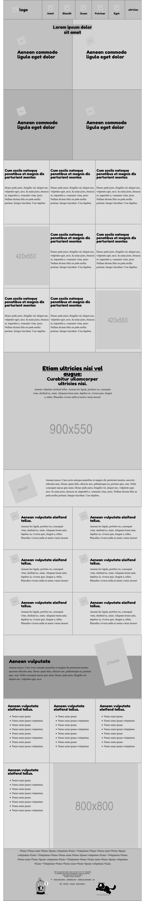

# MC-project5

## Microverse HTML/CSS project 5 - Individual
Individual Project to create an Apple clone page, using basic HTML and CSS.

#### I. The main focus of the project was the teardown of [smashingmagazine.com](https://www.smashingmagazine.com/)

#### II. The project was not prepared for mobile use and no mobile queries were used.

#### III. The layout is based in a CSS-based layout with floats.

#### III. The main areas of the project can be divided as follows:

  ###### &nbsp; The sectioning
  It was created by identifying each section in the main document. Each of them has been enclosed by using html elements and their corresponding border properties.

  ###### &nbsp; The picture elements
  The relevant pictures from the original site have been represented by placeholders of similar size.

  ###### &nbsp; The feature sections
  The regular sections have been colored white while the main sections were colored gray.

  ###### &nbsp; The text
  The main text has been represented both by similar size and font. To detach meaning the dummy text has been taken from fragments of text in Latin.

## Built With

- HTML & CSS
- Code Editors- Atom

## Live Demo

- [Live Demo Link](https://rawcdn.githack.com/Jhdezj/MC-project5/47963d491645f7dac5331e95b393ec7a93902a35/index.html)

## Author

👤 **Jorge Hernandez**

- Github: [@Jhdezj](https://github.com/Jhdezj)
